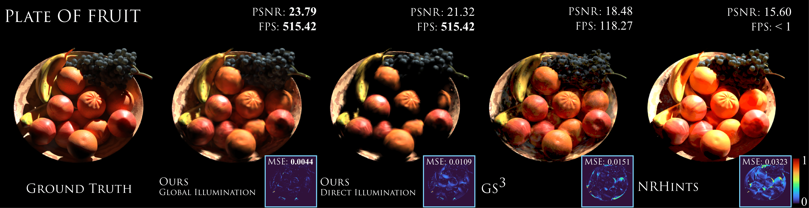

## Differentiable Light Transport with Gaussian Surfels via Adapted Radiosity for Efficient Relighting and Geometry Reconstruction <br><sub>Official PyTorch implementation of the ACM SIGGRAPH Asia 2025 paper</sub>



**Differentiable Light Transport with Gaussian Surfels via Adapted Radiosity for Efficient Relighting and Geometry Reconstruction**<br>
Kaiwen Jiang, Jia-Mu Sun, Zilu Li, Dan Wang, Tzu-Mao Li, Ravi Ramamoorthi<br>

[**Paper**](https://arxiv.org/abs/2509.18497v1) | [**Project**](https://raymondjiangkw.github.io/radiositygs.github.io/) | [**Video**](https://youtu.be/JlLbeYrC_Nc) | [**Data\&Results**](https://drive.google.com/drive/folders/1n1gTGrXJEtRSFmm_wzvZLyeQumwAm5EF?usp=sharing)

Abstract: *Radiance fields have gained tremendous success with applications ranging from novel view synthesis to geometry reconstruction, especially with the advent of Gaussian splatting. However, they sacrifice modeling of material reflective properties and lighting conditions, leading to significant geometric ambiguities and the inability to easily perform relighting. One way to address these limitations is to incorporate physically-based rendering, but it has been prohibitively expensive to include full global illumination within the inner loop of the optimization. Therefore, previous works adopt simplifications that make the whole optimization with global illumination effects efficient but less accurate. In this work, we adopt Gaussian surfels as the primitives and build an efficient framework for differentiable light transport, inspired from the classic radiosity theory. The whole framework operates in the coefficient space of spherical harmonics, enabling both diffuse and specular materials. We extend the classic radiosity into non-binary visibility and semi-opaque primitives, propose novel solvers to efficiently solve the light transport, and derive the backward pass for gradient optimizations, which is more efficient than auto-differentiation. During inference, we achieve view-independent rendering where light transport need not be recomputed under viewpoint changes, enabling hundreds of FPS for global illumination effects, including view-dependent reflections using a spherical harmonics representation. Through extensive qualitative and quantitative experiments, we demonstrate superior geometry reconstruction, view synthesis and relighting than previous inverse rendering baselines, or data-driven baselines given relatively sparse datasets with known or unknown lighting conditions.*

## Requirements
- We have done all the experiments on the Linux platform with an NVIDIA 6000 Ada GPU. We have also tested on NVIDIA A10 GPUs. Generally, an NVIDIA GPU with 24GB+ memory is recommended.
- CUDA toolkit 12.1 or later. (Why is a separate CUDA toolkit installation required? We use the OptiX 7.7 in our custom CUDA extensions.)
- Python libraries: see [environment.yml](./environment.yml) for exact library dependencies. You can use the following commands with Miniconda3 to create and activate your Python environment.
```bash
conda env create -f environment.yml
conda activate radiosity_gs
./install.sh
```

## Getting started
### Dataset Preparation
We currently only support the format as specified in [GS^3](https://github.com/gsrelight/gs-relight) where the location and intensity of point lights are provided, or the standard Blender/COLMAP format where a fixed environment map is assumed.

We require scaling the scene within the unit cube (as we limit the maximum scaling of Gaussian primitives) and using the HDR images for supervision (as we do not apply tone mapper). Exceptions to these requirements may demand hyper-parameters tuning and applying a tone mapper.

To synthesize a dataset using the Blender, we use the [script](https://github.com/iamNCJ/bpy-helper/tree/main/examples/nrhints-data) from NRHints. **Important:** Synthetic scene sometimes features an non-zero background strength. Please set that to `0` as we do not model an ambient light in our model.

### Training
Please use the following command to train a scene:
```bash
python train.py -s <path to dataset>
```

Commandline arguments for regularizations:
```bash
--lambda_dist            <number>       # hyperparameter for depth distortion
--solver_type            <PR | hybrid>  # solver for light transport.
                                        # - PR      => Direct Illumination
                                        # - hybrid  => Global Illumination
```

**Tip**: For a new scene, it is recommended to start without the depth distortion loss and only introduce it gradually once the baseline results are reasonable.

### Testing
Please use the following command to synthesize novel views, perform relighting, or extract the mesh:
```bash
python render.py -m <path to pre-trained model>
```
Commandline arguments for adjusting the TSDF fusion:
```bash
--voxel_size                            # voxel size
--depth_trunc                           # depth truncation
--solver_type            <PR | hybrid>  # solver for light transport.
                                        # - PR      => Direct Illumination
                                        # - hybrid  => Global Illumination
```
If `voxel_size` and `depth_trunc` are not specified, the script will automatically estimate them using the camera information.

For Stanford-ORB dataset, the script will automatically trigger the mesh quality evaluation.

### Inference
For pure inference without re-calculating the light transport, please first call the `renderGI` function as usual to calculate the light transport once, and then pass in the returned `radiosity` to the `override_radiosities` argument when the viewpoint changes.

An example is provided here:
```python
# Calculate the light transport once
render_pkg = renderGI(viewpoint_cam, gaussians, light_sources, ...)
radiosity = render_pkg['radiosity']
# Pure inference witout re-calculating the light transport
renderGI(viewpoint_cam, gaussians, light_sources, ..., override_radiosities=radiosity)
```

## Full Evaluation
### Dataset Preparation
We provide our sparse-view relighting dataset at [here](https://drive.google.com/file/d/16vWLJj-BFzM9KzVigWONXxz0Npp5YsH1/view?usp=sharing). Stanford-ORB dataset can be found at [here](https://github.com/StanfordORB/Stanford-ORB). We have re-implemented the algorithm for improved efficiency, which has slightly impacted performance compared to the original paper. The re-implemented codebase is optimized towards sparse-view relighting, while slightly affecting the performance on Stanford-ORB dataset.

You can report either the numbers from the paper or from this implementation, as long as they are discussed in a comparable setting.

For sparse-view relighting, please use the following command:
```bash
python scripts/view_synthesis_eval.py --dataset <path to the sparse-view relighting dataset>
```
<details>
<summary><span style="font-weight: bold;">Table Results</span></summary>

|                                  | **PSNR (25 Views)** | **SSIM (25 Views)** | **LPIPS (25 Views)** | **PSNR (50 Views)** | **SSIM (50 Views)** | **LPIPS (50 Views)** |
|----------------------------------|:-------------------:|:-------------------:|:--------------------:|:-------------------:|:-------------------:|:--------------------:|
| Paper (Global Illumination)      |       25.29       |        0.8950       |        0.0985        |       27.43       |        0.9151       |        0.0830        |
| Paper (Direct Illumination)      |       24.36       |        0.8794       |        0.1085        |       26.24       |        0.8982       |        0.0942        |
| Reproduced (Global Illumination) |       25.55       |        0.9001       |        0.0922        |       27.65       |        0.9186       |        0.0789        |
| Reproduced (Direct Illumination) |       24.46       |        0.8828       |        0.1035        |       26.37       |        0.9007       |        0.0894        |

</details>

For Stanford-ORB dataset, please use the following command:
```bash
python scripts/stanford_orb_eval.py --dataset <path to the Stanford-ORB dataset>
```
<details>
<summary><span style="font-weight: bold;">Table Results</span></summary>

|            | **CD (x 10^3)** | **PSNR (Test Views)** | **SSIM (Test Views)** | **LPIPS (Test Views)** | **PSNR (Relighting)** | **SSIM (Relighting)** | **LPIPS (Relighting)** |
|------------|:------------:|:---------------------:|:---------------------:|:----------------------:|:---------------------:|:---------------------:|:----------------------:|
| Paper      |     0.173    |         39.30         |         0.9894        |         0.0251         |         32.72         |         0.9721        |         0.0365         |
| Reproduced |     0.181    |         39.09         |         0.9890        |         0.0254         |         32.37         |         0.9706        |         0.0356         |

</details>

## Acknowledgements
Besides [GFSGS](https://github.com/RaymondJiangkw/GFSGS) and [2DGS](https://github.com/hbb1/2d-gaussian-splatting), this project also utilizes/takes inspire from [NRHints](https://github.com/iamNCJ/NRHints), [GS^3](https://github.com/gsrelight/gs-relight), [ndg-fitting](https://github.com/intel/ndg-fitting) and [torchoptix](https://github.com/eliphatfs/torchoptix). Many thanks to the authors!

## Citation
```bibtex
@article{jiang2025radiositygs,
  author  = {Jiang, Kaiwen and Sun, Jia-Mu and Li, Zilu and Wang, Dan and Li, Tzu-Mao and Ramamoorthi, Ravi},
  title   = {Differentiable Light Transport with Gaussian Surfels via Adapted Radiosity for Efficient Relighting and Geometry Reconstruction},
  year    = {2025},
  journal = {ACM Transactions on Graphics (TOG)}, 
  number  = {6}, 
  volume  = {44}, 
  month   = {December}
}
```